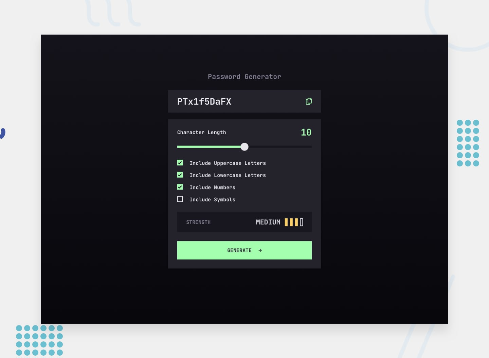

# Frontend Mentor - Password generator app

## Table of contents

- [Overview](#overview)
  - [The challenge](#the-challenge)
  - [Links](#links)
- [My process](#my-process)
  - [Built with](#built-with)
  - [What I learned](#what-i-learned)
  - [Continued development](#continued-development)
- [Author](#author)

**To do this challenge, you need a strong understanding of HTML, CSS, and JavaScript.**

## The challenge

Your challenge is to build out this password generator app and get it looking as close to the design as possible.

You can use any tools you like to help you complete the challenge. So if you've got something you'd like to practice, feel free to give it a go.

Your users should be able to:

- Generate a password based on the selected inclusion options
- Copy the generated password to the computer's clipboard
- See a strength rating for their generated password
- View the optimal layout for the interface depending on their device's screen size
- See hover and focus states for all interactive elements on the page

### Links

- Repository URL: [Github](https://github.com/md5dalton/pw-gen)
- Live Site URL: [Vercel](https://pw-gen-three.vercel.app/)

## My process

### Built with

- Semantic HTML5 markup
- CSS custom properties
- CSS Flex
- [React](https://reactjs.org/) - JS library
- [Sass](https://sass-lang.com/) - CSS Extension Language

### What I learned

 - React custom hooks
 - React Context API vs useState

### Continued development

 - React Context API
 - CSS :hover for mobile

## Author

- Github - [Dalton](https://github.com/md5dalton)
- Frontend Mentor - [@md5dalton](https://www.frontendmentor.io/profile/md5dalton)
- Twitter - [@md5dalton](https://twitter.com/md5dalton)